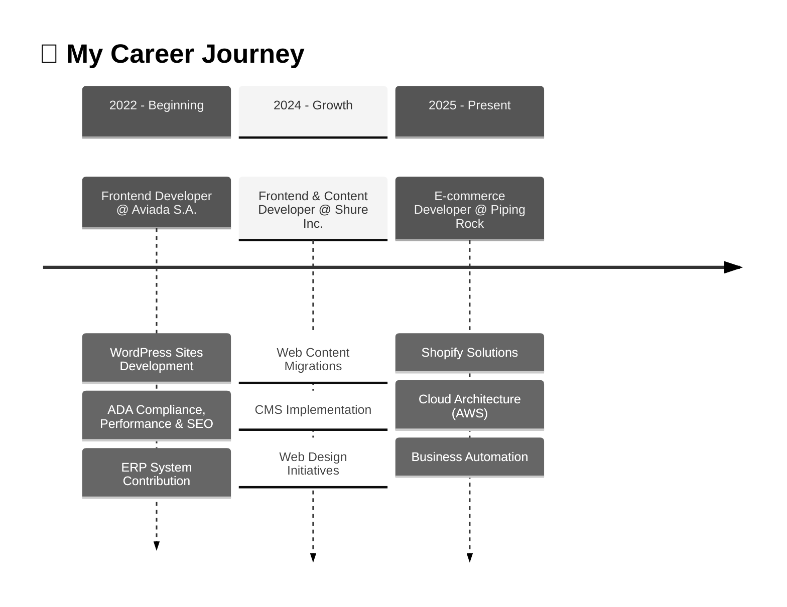

<h1 align="center">Hi there! 👋 I'm Paul Isaac</h1>
<h3 align="center">Full-Stack Developer & Software Engineer</h3>
<p align="center">
  <em>Building scalable digital experiences with 3+ years of expertise</em>
</p>
<p align="center">
  E-commerce • ERP Systems • Web Applications
</p>

<h3 align="center">🚀 Transforming Ideas into Scalable Digital Solutions</h3>

<p align="center">
  <em>Passionate about crafting web applications</em>
</p>

---

### 👨‍💻 About Me

I'm a **Full-Stack Developer & Software Engineer** with **3+ years of experience** specializing in E-commerce platforms, ERP systems, and scalable web applications. I combine technical expertise with a deep understanding of user needs to deliver exceptional digital experiences.

```typescript
const paul = {
  location: "Available Worldwide",
  currentRole: "E-commerce Developer @ Piping Rock Health Products",
  focus: ["E-commerce Solutions", "Cloud Architecture", "Automation"],
  philosophy: "Clean code, scalable solutions, user-centric design",
  interests: ["Open Source", "New Technologies", "Developer Community"]
};
```

- 🔭 Currently working on **E-commerce automations** and **cloud-based solutions**
- 🌱 Always learning and exploring **cutting-edge technologies**
- 💡 Passionate about **Software Architecture** and **Best Practcies**
- 🎯 Mission: Transform complex challenges into elegant, scalable solutions
- 📫 Reach me: **paulisaak.dev@outlook.com**

---

### 🛠️ Tech Stack

<details open>
<summary><b>Frontend Development</b></summary>
<br>


</details>

<details open>
<summary><b>Styles</b></summary>
<br>


</details>

<details open>
<summary><b>Backend</b></summary>
<br>


</details>

<details open>
<summary><b>Other Dev Tools</b></summary>
<br>


</details>

<details open>
<summary><b>AI Tools</b></summary>
<br>


</details>

---

### 💼 Professional Experience



**🏢 Current:** E-commerce Developer at **Piping Rock Health Products** (2025 - Present)
- Developing Shopify e-commerce solutions and implementing business automations
- Working with AWS cloud services to optimize processes
- Building scalable systems for high-traffic environments

**🎵 Previous:** Frontend Developer at **Shure Inc.** (2024)
- Web migrations and CMS implementations
- Contributed to web design initiatives

**✈️ Previous:** Frontend Developer at **Aviada S.A. de C.V.** (2022 - 2025)
- WordPress development with ADA compliance and SEO optimization
- Contributed to ERP system development

---

### 🎯 What I Bring to the Table

- ✨ **Pixel-Perfect Development**: Attention to detail in every component
- 🚀 **Performance Optimization**: Fast, efficient, and scalable applications
- ♿ **Accessibility First**: WCAG compliant and inclusive design
- 📱 **Responsive Design**: Seamless experiences across all devices
- 🧪 **Quality Assurance**: Clean, maintainable, and tested code

---

### 🌟 Featured Projects & Achievements

- 🛒 **15+ Projects Completed** across E-commerce, ERP, and Web Sites
- 🎓 **3+ Years** of professional development experience
- 💻 **20+ Technologies** in my base of knowledge
- 🌐 Available for **remote opportunities worldwide**

---

### 📫 Let's Connect

<div align="center">
  
[](https://pitdev.dev/)
[](mailto:paulisaak.dev@outlook.com)
[](https://www.linkedin.com/in/paulisaakdev/)
[](https://github.com/PolIsaak)

</div>

---

### 💭 Philosophy

> *"My approach to development is guided by a commitment to excellence, innovation, and creating meaningful impact through technology. I believe in writing clean, maintainable code that stands the test of time and adapts to evolving needs."*

**Core Values:**
- 🎯 **Innovation** - Embracing cutting-edge technologies
- 👥 **User-Centric** - Putting users first in every decision
- 💎 **Quality** - Excellence in every line of code
- 📈 **Growth** - Continuously learning and evolving

---

<div align="center">
  
</div>

<div align="center">
  <p><em>⚡ "Transform complex challenges into elegant, scalable solutions" ⚡</em></p>
  <p>⭐ From <a href="https://github.com/PolIsaak">PolIsaak</a></p>
</div>
